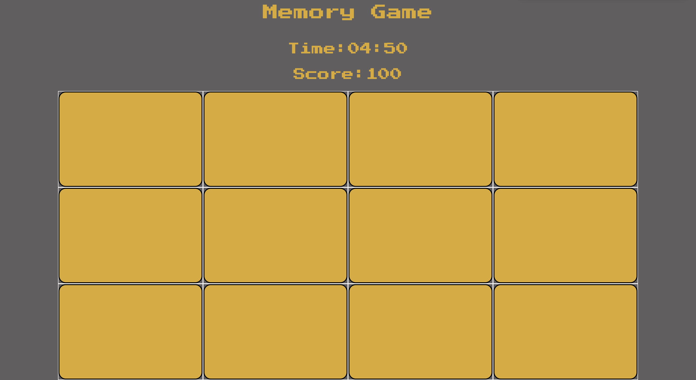

# Memory Game

# Introduction
Memory Game has long been a favorite game for all generations. It is easy to play, in fact it is so simple that really young children can play with ease.
It requires observation, concentration and a good memory to win.
This game is designed for a single player.

# Live demo 
A live demo can be found here :
https://ka-pa-ra.github.io/Memory-game/

# UX
This website is been build and designed for gaming users and to test a users memory.

# Instructions
* Click on a card
* Keep revealing cards and working your memory to remember each unveiled card.
* Match cards properly with less moves and in faster time

# Technologies Used
*HTML was the language used to structure and present content for the web.
*CSS3 was the language used in the styling and formatting the website content.
*GitPod was the cloud-based IDE used, to write, run, and debug code with the web browser and to create the website.
*Bootstrap a front-end component library, that was used to build responsive, mobile-first projects on the website.
*Chrome Developer Tools was used to ensure that the responsive design worked properly.
*GitHub was used for version control, o have a working copy/snippet of the code and full change history on the local machine.
*FontAwesome was the preferred library, for the icons used on the website.
*Google Fonts To find the appropriate typefaces for a website of this type.

# Deployment
The project was created by using the services of GitHub and the GitPod IDE. The project was edited in Gitpod and pushed and committed to Github repository.

To deploy the website I followed the follow steps:
 1. Navigate to the project’s repository;
 2. Navigate to the settings page;
 3. Scroll down to the section titled GitHub Pages;
 4. Select Master Branch from the Source dropdown;
 5. The GitHub Pages section changed to inform me that my site was ready to be published at https://ka-pa-ra.github.io/Francesco-Liverano-Private-Chef/ .

 # Credits/Media 
 * https://unsplash.com// - For providing the possibility to use images. Also some images used are been taken form Francesco Liverano Instagram page.
 * https://www.w3schools.com - For the idea of how to solve various issues.
 * https://getbootstrap.com Bootstrap - for very detailed Documentation.

 # Content 
 Some text content are been copied/re-write  from various websites on the web .

# Disclaimer
This project is for **educational** purposes only and will **NOT** be used in business or advertising.
